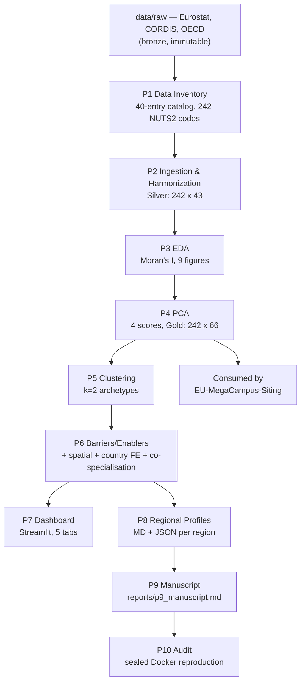

# EU Regional Innovation Panel

   

> An exploratory, non-causal descriptive analysis of EU NUTS2 regional innovation ecosystems — characterizing regional variation and producing a data-driven archetype taxonomy. It does **not** establish causal relationships, make predictions, or prescribe policy.

This is the base study of a three-project research programme: its Gold layer feeds directly into [EU-MegaCampus-Siting](https://github.com/andrm101/eu-megacampus-siting)'s site-intelligence scoring.

---

## Key findings

- **k = 2** silhouette-optimal archetypes (silhouette = **0.409**): **A1 — Catching-up & peripheral** (108 regions) vs. **A2 — Advanced innovation** (134 regions)
- Strong spatial autocorrelation — Global Moran's I: archetype = **0.515**, prosperity = **0.751** — A2 clusters spatially, A1 is more dispersed
- Top archetype-separating enablers: GDP/capita (**d = 2.32**), HRST (**d = 2.06**), enterprise internet use (**d = 1.81**)
- 10-pattern co-specialisation typology: 78.5% of regions specialised in ≥1 sector, 39.3% co-specialised in ≥2
- Full manuscript (4,341 words), interactive Streamlit dashboard (5 tabs, NUTS2 choropleth), and a sealed Docker reproduction path validated end-to-end

## Non-causal framing (strict)

> All findings are described with hedged, associational language — *"associated with"*, *"correlates with"*, *"characterizes"* — never causal claims.

A `vocab_guard.py` script auto-enforces a forbidden-token list (e.g. "best region", "causes", "we recommend locating") across every artifact before commit.

---

## Architecture



## Medallion architecture

| Layer | Path | Contents |
|---|---|---|
| Bronze | `data/bronze/` | Raw files as received, never modified |
| Silver | `data/silver/` | Harmonized, imputed, NUTS-aligned panel |
| Gold | `data/gold/` | Silver + PCA scores + archetype assignments |

## Data sources (Eurostat-first)

1. Eurostat bulk downloads (primary)
2. CORDIS CSV bulk download (Horizon Europe project data)
3. OECD.Stat bulk export (supplementary)

No EPO PATSTAT registration — patent activity proxied via Eurostat `pat_ep_rtot`.

---

## Status

| Phase | Result |
|---|---|
| P0–P9 | PASS — full pipeline, manuscript, dashboard |
| P10 — Reproducibility Audit | PASS — seed audit, vocab guard, content-hash verification, and a sealed Docker `docker build` + `make reproduce` + `make audit` run all green; caught and fixed 8 real bugs along the way (wrong GDAL registry, missing wheel config, a stale Python 3.11 apt package, a broken PPA add, an unsatisfiable dependency pin, `uv` missing from the runtime image, a stale Makefile target, and a `make reproduce` that discarded every containerized output) |

Full phase-by-phase detail in `CLAUDE.md`.

## Reproducibility conventions

`np.random.seed(42)` / `random_state=42` set everywhere; randomness logged via `src/utils/logging_config.py`. `nuts2_code` (`^[A-Z]{2}[A-Z0-9]{2}$`) is the immutable primary key throughout.

---

## Running it

```bash
docker build -t eu-innov:latest .
make reproduce   # ~90-120 min, all phases
make audit       # verify pipeline_audit.json == PASS
make dashboard   # localhost:8050 (Streamlit: localhost:8501)
```

Full instructions in `REPRODUCE.md`.
