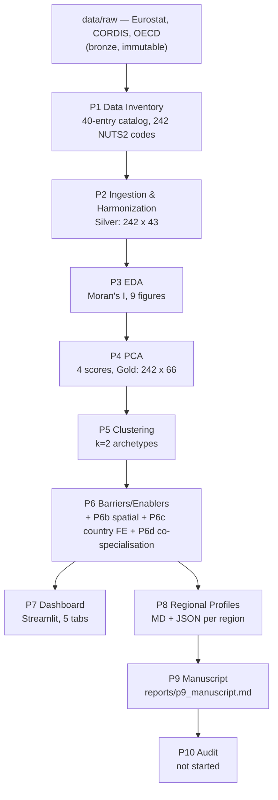

# EU Regional Innovation Panel

An exploratory, non-causal descriptive analysis of EU NUTS2 regional innovation ecosystems. The project characterizes regional variation across 242 NUTS2 regions and produces a data-driven archetype taxonomy — it does **not** establish causal relationships, make predictions, or prescribe policy.

## Status: complete

All ten phases (P0–P9) passed; P10 audit not started. See "Phase Status" below.

## Key findings

- **k = 2** silhouette-optimal archetypes (silhouette = 0.409): **A1 — Catching-up & peripheral** (108 regions) vs. **A2 — Advanced innovation** (134 regions)
- Strong spatial autocorrelation (Global Moran's I: archetype = 0.515, prosperity = 0.751), with A2 clustering spatially and A1 more dispersed
- Top enablers separating archetypes: GDP/capita (d = 2.32), HRST (d = 2.06), enterprise internet use (d = 1.81)
- Full manuscript (4,341 words) and interactive Streamlit dashboard (5 tabs, NUTS2 choropleth)

## Non-causal framing (strict)

All findings are described with hedged, associational language ("associated with", "correlates with", "characterizes") — never causal claims. A `vocab_guard.py` script auto-enforces a forbidden-token list (e.g. "best region", "causes", "we recommend locating") across every artifact before commit.

## Architecture



## Medallion architecture

- **Bronze** (`data/bronze/`) — raw files as received, never modified
- **Silver** (`data/silver/`) — harmonized, imputed, NUTS-aligned panel
- **Gold** (`data/gold/`) — Silver + PCA scores + archetype assignments

## Reproducing

Full instructions in `REPRODUCE.md`. Docker path:

```bash
docker build -t eu-innov:latest .
make reproduce   # ~90-120 min, all phases
make audit       # verify pipeline_audit.json == PASS
```

Dashboard: `make dashboard` → `localhost:8050` (Streamlit app: `localhost:8501`).

## Data sources (Eurostat-first)

1. Eurostat bulk downloads (primary)
2. CORDIS CSV bulk download (Horizon Europe project data)
3. OECD.Stat bulk export (supplementary)

No EPO PATSTAT registration — patent activity proxied via Eurostat `pat_ep_rtot`.

## Reproducibility conventions

`np.random.seed(42)` / `random_state=42` set everywhere; randomness logged via `src/utils/logging_config.py`. `nuts2_code` (`^[A-Z]{2}[A-Z0-9]{2}$`) is the immutable primary key throughout.
